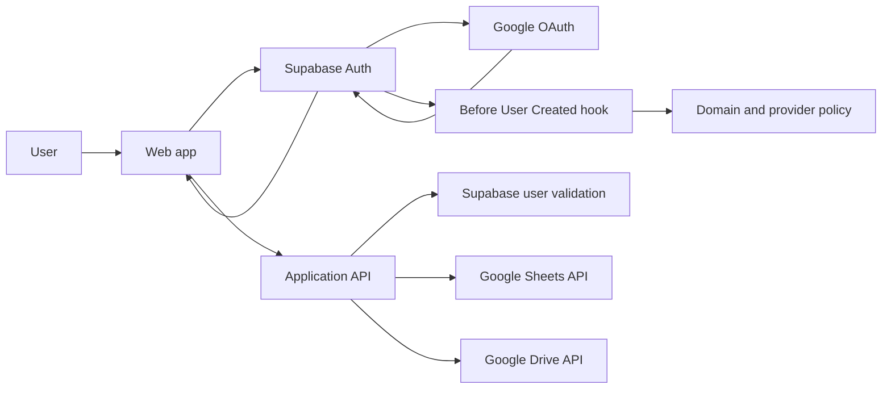

# Google Auth System with Supabase

คู่มือนี้อธิบายระบบ Google OAuth สำหรับเว็บแอปที่ใช้ Supabase Auth และต้องการ:

- Login ด้วย Google
- จำกัดผู้ใช้เฉพาะ Google Workspace domain
- อ่าน Google Sheets ในนามผู้ใช้
- สร้างหรืออัปโหลดไฟล์เข้า Google Drive
- แสดงชื่อและรูปโปรไฟล์ Google
- นำโครงสร้างไปใช้ซ้ำในโปรเจกต์อื่น

ตัวอย่างใช้ React, TypeScript และ `@supabase/supabase-js` แต่แนวคิดเดียวกันใช้กับ framework อื่นได้

## 1. ค่าที่ต้องเปลี่ยนเมื่อใช้กับโปรเจกต์อื่น

แทนค่าต่อไปนี้ให้ตรงกับโปรเจกต์ใหม่:

```text
APP_NAME=Your App
APP_URL=https://app.example.com
LOCAL_URL=http://localhost:3000
ALLOWED_DOMAIN=example.com
SUPABASE_PROJECT_REF=your-project-ref
```

Supabase callback URL:

```text
https://SUPABASE_PROJECT_REF.supabase.co/auth/v1/callback
```

## 2. Architecture



มี token สองประเภทที่ห้ามสลับกัน:

| Token | ออกโดย | ใช้ทำอะไร |
| --- | --- | --- |
| Supabase access token | Supabase Auth | ยืนยันตัวตนกับ API และ Supabase |
| Google provider access token | Google ผ่าน Supabase | เรียก Google Drive หรือ Sheets API |

Supabase JWT ใช้เรียก Google API ไม่ได้ และ Google provider token ไม่ควรใช้แทน Supabase JWT เพื่อยืนยันสิทธิ์ในระบบของเรา

## 3. Security model

การจำกัดเฉพาะ Workspace domain ควรทำหลายชั้น:

1. Google Auth Platform Audience ตั้งเป็น `Internal`
2. ส่ง `hd=example.com` เพื่อช่วย Google account chooser
3. ใช้ Supabase Before User Created hook ปฏิเสธ provider และ domain ที่ไม่อนุญาต
4. Frontend ตรวจ email ก่อนเปิดหน้าภายใน
5. Backend ตรวจ user จาก Supabase Auth ทุก request
6. RLS ตรวจ domain หรือ custom claim สำหรับการเข้าถึงข้อมูล

`hd` เป็นเพียง account-selection hint ไม่ใช่ security boundary

ห้ามใช้ `user_metadata` เช่น `full_name`, `avatar_url` หรือ `picture` เป็นข้อมูล authorization เพราะผู้ใช้สามารถแก้ไข metadata ได้ ให้ใช้ email ที่ตรวจจาก Supabase Auth, `app_metadata`, RLS หรือ server-side policy แทน

## 4. Google Cloud setup

### 4.1 Project และ Audience

1. เปิด Google Cloud project ที่อยู่ภายใต้ Google Workspace organization
2. ไปที่ Google Auth Platform
3. ตั้ง Audience เป็น `Internal` สำหรับ internal company app
4. ตั้งชื่อแอป, support email, logo และ authorized domains

หากแอปต้องให้คนนอก organization ใช้ ให้เลือก audience ที่เหมาะสมและตรวจข้อกำหนดการ verification เพิ่มเติม

### 4.2 Enable APIs

เปิด API เท่าที่ระบบใช้:

```text
Google Drive API
Google Sheets API
```

### 4.3 OAuth scopes

Scopes พื้นฐานสำหรับ login:

```text
openid
https://www.googleapis.com/auth/userinfo.email
https://www.googleapis.com/auth/userinfo.profile
```

Scopes สำหรับตัวอย่างนี้:

```text
https://www.googleapis.com/auth/drive.file
https://www.googleapis.com/auth/spreadsheets.readonly
```

ความหมาย:

- `drive.file` ให้แอปทำงานกับไฟล์ที่แอปสร้างหรือไฟล์ที่ผู้ใช้เลือกให้แอปเข้าถึง เป็น scope ที่แคบกว่าการขอ Drive ทั้งหมด
- `spreadsheets.readonly` อ่านข้อมูลใน Google Sheets ที่ผู้ใช้มีสิทธิ์เข้าถึง แต่แก้ไขไม่ได้

ขอเฉพาะ scope ที่จำเป็น ถ้า feature ยังไม่ถูกใช้ อาจขอสิทธิ์แบบ incremental ตอนผู้ใช้เริ่มใช้ feature นั้น

### 4.4 OAuth client

สร้าง OAuth Client ประเภท `Web application`

Authorized JavaScript origins:

```text
https://app.example.com
http://localhost:3000
```

Authorized redirect URIs:

```text
https://SUPABASE_PROJECT_REF.supabase.co/auth/v1/callback
```

ใช้ callback URL ที่แสดงใน Supabase Dashboard เป็นค่าหลัก อย่าเดา project ref

## 5. Supabase setup

### 5.1 Enable Google provider

ไปที่:

```text
Authentication
→ Providers
→ Google
```

จากนั้น:

1. เปิด Google provider
2. ใส่ Google OAuth Client ID
3. ใส่ Google OAuth Client Secret
4. Save

Google Client Secret ต้องอยู่ใน Supabase configuration หรือ server secret เท่านั้น ห้ามใส่ใน `VITE_*`, `NEXT_PUBLIC_*` หรือ bundle ฝั่ง browser

### 5.2 URL configuration

ไปที่:

```text
Authentication
→ URL Configuration
```

ตัวอย่าง:

```text
Site URL:
https://app.example.com

Redirect URLs:
https://app.example.com
http://localhost:3000
```

`redirectTo` ที่ส่งจากโค้ดต้องอยู่ใน redirect allow list

### 5.3 Environment variables

ค่าฝั่ง browser:

```bash
VITE_SUPABASE_URL=https://SUPABASE_PROJECT_REF.supabase.co
VITE_SUPABASE_ANON_KEY=<publishable-or-anon-key>
```

ค่าที่ห้ามส่งเข้า browser:

```bash
SUPABASE_SERVICE_ROLE_KEY=
GOOGLE_CLIENT_SECRET=
GOOGLE_PROVIDER_REFRESH_TOKEN=
```

## 6. Restrict signup by provider and domain

สร้าง migration และเปลี่ยน `example.com` กับข้อความให้ตรงกับโปรเจกต์:

```sql
create or replace function public.hook_restrict_google_workspace_signup(
  event jsonb
)
returns jsonb
language plpgsql
as $$
declare
  account_email text := lower(
    trim(coalesce(event->'user'->>'email', ''))
  );
  account_provider text := lower(
    trim(coalesce(event->'user'->'app_metadata'->>'provider', ''))
  );
begin
  if account_provider <> 'google' then
    return jsonb_build_object(
      'error',
      jsonb_build_object(
        'http_code', 403,
        'message', 'Sign in with your company Google account.'
      )
    );
  end if;

  if account_email !~ '^[^@[:space:]]+@example[.]com$' then
    return jsonb_build_object(
      'error',
      jsonb_build_object(
        'http_code', 403,
        'message', 'This app is available only to @example.com accounts.'
      )
    );
  end if;

  return '{}'::jsonb;
end;
$$;

grant usage on schema public to supabase_auth_admin;

grant execute
  on function public.hook_restrict_google_workspace_signup(jsonb)
  to supabase_auth_admin;

revoke execute
  on function public.hook_restrict_google_workspace_signup(jsonb)
  from authenticated, anon, public;
```

หลังจาก apply migration:

```text
Authentication
→ Hooks
→ Before User Created
→ Hook type: Postgres
→ Schema: public
→ Function: hook_restrict_google_workspace_signup
```

เปิด hook และ Save

Hook นี้บล็อกเฉพาะการสร้าง user ใหม่ สำหรับ user เก่าที่มีอยู่แล้ว backend และ RLS ยังต้องตรวจ domain ทุกครั้ง

## 7. Frontend sign-in

```ts
const GOOGLE_SCOPES = [
  "https://www.googleapis.com/auth/drive.file",
  "https://www.googleapis.com/auth/spreadsheets.readonly"
].join(" ");

async function signInWithGoogle() {
  const { error } = await supabase.auth.signInWithOAuth({
    provider: "google",
    options: {
      redirectTo:
        window.location.hostname === "localhost"
          ? window.location.origin
          : "https://app.example.com",
      scopes: GOOGLE_SCOPES,
      queryParams: {
        hd: "example.com",
        include_granted_scopes: "true",
        prompt: "consent"
      }
    }
  });

  if (error) throw error;
}
```

ใช้ Google branding asset และข้อความที่ Google รองรับ เช่น:

```text
Sign in with Google
Continue with Google
```

## 8. Session handling

Subscribe การเปลี่ยน session และตรวจ domain ซ้ำ:

```ts
const ALLOWED_EMAIL = /^[^@\s]+@example\.com$/;

function isAllowedEmail(email: string | undefined): boolean {
  return ALLOWED_EMAIL.test((email ?? "").trim().toLowerCase());
}

const {
  data: { subscription }
} = supabase.auth.onAuthStateChange((_event, session) => {
  if (session && !isAllowedEmail(session.user.email)) {
    void supabase.auth.signOut();
    return;
  }

  // Store session in app state.
});

// React effect cleanup
subscription.unsubscribe();
```

Frontend check มีไว้ป้องกัน UI และเพิ่ม UX เท่านั้น Backend/RLS ต้องเป็นตัวตัดสิน authorization จริง

## 9. Google provider token lifecycle

หลัง OAuth สำเร็จ Supabase session อาจมี:

```ts
session.provider_token
session.provider_refresh_token
```

Supabase ไม่ refresh Google provider token ให้ และตั้งใจไม่เก็บ provider token ไว้ใน database ของโปรเจกต์

เลือกกลยุทธ์ตามระบบ:

### Option A: Browser session แบบง่าย

เหมาะกับ internal tools ที่ยอมให้ login ใหม่เมื่อ Google token หมดอายุ:

- เก็บ provider access token ใน memory หรือ `sessionStorage`
- กำหนดอายุสั้นกว่าของจริงเล็กน้อย เช่น 55 นาที
- ลบเมื่อ sign out
- หาก Google ตอบ 401 ให้ลบ token และให้ user sign in ใหม่
- ห้าม log token

หากใช้ `localStorage` ต้องยอมรับความเสี่ยงจาก XSS และควรมี CSP, dependency control และอายุ token ที่สั้น

ตัวอย่าง:

```ts
const TOKEN_KEY = "app.google-provider-token";
const EXPIRES_KEY = "app.google-provider-token-expires-at";
const TOKEN_TTL_MS = 55 * 60 * 1000;

export function captureGoogleToken(
  session: { provider_token?: string | null } | null
) {
  if (!session?.provider_token) return;

  sessionStorage.setItem(TOKEN_KEY, session.provider_token);
  sessionStorage.setItem(
    EXPIRES_KEY,
    String(Date.now() + TOKEN_TTL_MS)
  );
}

export function currentGoogleToken(): string | null {
  const token = sessionStorage.getItem(TOKEN_KEY);
  const expiresAt = Number(sessionStorage.getItem(EXPIRES_KEY));

  if (!token || !Number.isFinite(expiresAt) || expiresAt <= Date.now()) {
    sessionStorage.removeItem(TOKEN_KEY);
    sessionStorage.removeItem(EXPIRES_KEY);
    return null;
  }

  return token;
}
```

### Option B: Long-lived server integration

เหมาะกับ background jobs หรือระบบที่ไม่ควรให้ user login ใหม่ทุกชั่วโมง:

1. ส่ง `access_type=offline` และ `prompt=consent`
2. รับ `provider_refresh_token` หลัง OAuth
3. ส่ง refresh token ไป trusted backend ผ่าน HTTPS
4. เข้ารหัสก่อนเก็บใน server-side secret store หรือ encrypted database column
5. จำกัดผู้ที่อ่าน token ได้
6. ใช้ refresh token ขอ access token ใหม่บน server
7. รองรับ revoke, rotation และ user disconnect

ห้ามเก็บ Google refresh token ใน browser storage

ตัวอย่าง query params:

```ts
queryParams: {
  access_type: "offline",
  prompt: "consent"
}
```

Google อาจส่ง refresh token เฉพาะตอน consent ครั้งแรกหรือเมื่อบังคับ consent ใหม่ จึงต้องออกแบบ flow การเชื่อมบัญชีและ reconnect ให้ชัดเจน

## 10. Protect application APIs

Request ที่อ่าน Google data ควรมี:

```http
Authorization: Bearer <supabase-access-token>
X-Google-Access-Token: <google-provider-access-token>
```

ลำดับที่ backend ต้องทำ:

1. ตรวจ Supabase access token
2. โหลด user จาก Supabase Auth
3. ตรวจ exact email domain หรือ server-side claim
4. ตรวจว่ามี Google provider token
5. เรียก Google API ด้วย Google token
6. ไม่เขียน token ลง log, error response หรือ analytics

ตัวอย่างตรวจ Supabase user:

```ts
async function resolveAuthorizedUser(
  authorization: string,
  supabaseUrl: string,
  supabaseAnonKey: string
) {
  const response = await fetch(`${supabaseUrl}/auth/v1/user`, {
    headers: {
      apikey: supabaseAnonKey,
      Authorization: authorization
    }
  });

  if (!response.ok) return null;

  const user = await response.json();
  const email = String(user.email ?? "").trim().toLowerCase();
  const providers = Array.isArray(user.app_metadata?.providers)
    ? user.app_metadata.providers
    : [];

  return /^[^@\s]+@example\.com$/.test(email) &&
    providers.includes("google")
    ? user
    : null;
}
```

สำหรับ server framework ที่มี Supabase SSR helpers ให้ใช้ server client และ `getUser()` แทนการเขียน request เอง

## 11. Read a private Google Sheet

อ่าน spreadsheet metadata:

```ts
const metadataResponse = await fetch(
  `https://sheets.googleapis.com/v4/spreadsheets/${spreadsheetId}` +
    "?fields=properties.title,sheets.properties",
  {
    headers: {
      Authorization: `Bearer ${googleAccessToken}`
    }
  }
);
```

อ่าน values:

```ts
const range = encodeURIComponent("'1. Questionnaire'");

const valuesResponse = await fetch(
  `https://sheets.googleapis.com/v4/spreadsheets/${spreadsheetId}` +
    `/values/${range}?majorDimension=ROWS`,
  {
    headers: {
      Authorization: `Bearer ${googleAccessToken}`
    }
  }
);
```

เงื่อนไข:

- User ที่ login ต้องมีสิทธิ์อ่าน Sheet
- Sheet ไม่ต้องเปิด `Anyone with the link`
- `spreadsheets.readonly` ไม่ให้สิทธิ์แก้ไข
- ตรวจชื่อ tab ก่อนอ่านหาก workflow ต้องการ tab เฉพาะ

## 12. Create Google Slides through Drive

การแปลง PowerPoint เป็น Google Slides ใช้ Drive API upload โดยระบุ Google Slides MIME type:

```text
Source MIME:
application/vnd.openxmlformats-officedocument.presentationml.presentation

Target MIME:
application/vnd.google-apps.presentation
```

Authorization:

```http
Authorization: Bearer <google-provider-access-token>
```

เมื่อใช้ `drive.file` แอปไม่ควรคาดหวังว่าจะมองเห็น Drive ทั้งหมดของผู้ใช้

## 13. Profile data and avatar

Supabase user object มักได้รับ provider metadata เช่น:

```ts
session.user.email
session.user.user_metadata.full_name
session.user.user_metadata.avatar_url
session.user.user_metadata.picture
```

ตัวอย่างแสดงรูป:

```ts
function profileImageUrl(session: Session): string | null {
  const metadata = session.user.user_metadata;
  const candidate =
    typeof metadata.avatar_url === "string"
      ? metadata.avatar_url
      : typeof metadata.picture === "string"
        ? metadata.picture
        : "";

  try {
    const url = new URL(candidate);
    return url.protocol === "https:" ? url.toString() : null;
  } catch {
    return null;
  }
}
```

UI ควรมี fallback icon เมื่อไม่มีรูปหรือรูปโหลดไม่สำเร็จ และแนะนำให้ใช้:

```html

```

แอปเก็บเพียง URL จาก metadata ไม่จำเป็นต้องคัดลอกรูปเข้า Supabase Storage

## 14. RLS example

สำหรับระบบ internal domain:

```sql
create or replace function public.is_allowed_company_user()
returns boolean
language sql
stable
as $$
  select coalesce(
    auth.role() = 'authenticated'
    and lower(trim(coalesce(auth.jwt() ->> 'email', '')))
      ~ '^[^@[:space:]]+@example[.]com$',
    false
  );
$$;
```

ใช้ function นี้ใน RLS policy ของตารางที่ต้องป้องกัน

สำหรับระบบที่ซับซ้อนกว่า ควรใช้ membership table หรือ custom claim แทนการผูก authorization กับ domain เพียงอย่างเดียว

## 15. Sign out

Sign out ต้องล้างทั้ง Supabase session และ Google token ที่แอป cache:

```ts
async function signOut() {
  sessionStorage.removeItem("app.google-provider-token");
  sessionStorage.removeItem("app.google-provider-token-expires-at");

  const { error } = await supabase.auth.signOut();
  if (error) throw error;
}
```

## 16. Test checklist

### Authentication

- [ ] `@example.com` login สำเร็จ
- [ ] Gmail ส่วนตัวถูกปฏิเสธ
- [ ] OAuth provider อื่นถูก Before User Created hook ปฏิเสธ
- [ ] User เก่านอก domain ถูก backend ปฏิเสธ
- [ ] Redirect production กลับ URL ที่ถูกต้อง
- [ ] Redirect localhost กลับ local URL
- [ ] Sign out ล้าง session และ cached Google token

### Google APIs

- [ ] Private Sheet ที่ user มีสิทธิ์อ่านได้
- [ ] Private Sheet ที่ user ไม่มีสิทธิ์อ่านตอบ 403
- [ ] Google token หมดอายุตอบข้อความ reconnect ที่เข้าใจง่าย
- [ ] `spreadsheets.readonly` ไม่สามารถเขียน Sheet
- [ ] สร้าง Slides ได้ด้วย `drive.file`
- [ ] แอปไม่เห็นไฟล์ Drive อื่นโดยไม่จำเป็น

### Profile

- [ ] แสดง Google avatar เมื่อมี
- [ ] Fallback icon เมื่อไม่มี avatar
- [ ] Fallback icon เมื่อ image load failed
- [ ] ไม่ใช้ profile metadata ตัดสิน authorization

## 17. Troubleshooting

### Redirect URI mismatch

ตรวจสามจุด:

1. Google OAuth Client authorized redirect URI
2. Supabase Google provider callback URL
3. Supabase redirect allow list และ `redirectTo`

ค่าต้องตรงทั้ง protocol, host, port และ path

### This app is blocked

ตรวจ:

- Audience ถูกต้องหรือไม่
- OAuth client อยู่ใน Google Cloud project ของ organization หรือไม่
- User อยู่ใน Workspace organization หรือไม่
- Scopes ถูกตั้งใน Data Access หรือไม่
- Google API ที่เกี่ยวข้องเปิดแล้วหรือไม่

### Insufficient authentication scopes

สาเหตุที่พบบ่อย:

- ไม่ได้ส่ง scope ใน `signInWithOAuth`
- User เคย consent ก่อนเพิ่ม scope
- ใช้ Supabase access token เรียก Google API
- ใช้ provider token เก่าที่ไม่มี scope ใหม่

แก้โดย sign out, sign in ใหม่ และ consent scopes ชุดปัจจุบัน

### Google token expired

Supabase session อาจยัง valid แต่ Google provider token หมดอายุแล้ว:

- Option A: ล้าง token และให้ login ใหม่
- Option B: ใช้ encrypted refresh token บน trusted backend

### Profile image ไม่แสดง

ตรวจ:

- `user_metadata.avatar_url`
- `user_metadata.picture`
- URL เป็น HTTPS
- image host ไม่ถูก CSP `img-src` บล็อก
- UI มี `onError` fallback

### Hook function ไม่ปรากฏใน Dashboard

ตรวจ:

- Migration ถูก apply ใน Supabase project ที่ถูกต้อง
- Function อยู่ใน schema `public`
- Function รับ parameter `event jsonb`
- Grant execute ให้ `supabase_auth_admin`
- Refresh หน้า Authentication Hooks

## 18. Production security checklist

- [ ] Google Client Secret ไม่อยู่ใน frontend env
- [ ] Supabase service role key ไม่อยู่ใน frontend
- [ ] ใช้ HTTPS ใน production
- [ ] ตรวจ domain ที่ backend และ RLS
- [ ] Before User Created hook เปิดใช้งาน
- [ ] ไม่ถือว่า `hd` เป็น authorization
- [ ] ไม่ใช้ `user_metadata` สำหรับ authorization
- [ ] ไม่ log Google token หรือ Supabase token
- [ ] Provider token มีอายุสั้น
- [ ] Refresh token เก็บแบบเข้ารหัสบน trusted server เท่านั้น
- [ ] ขอ OAuth scopes เท่าที่จำเป็น
- [ ] มี CSP และป้องกัน XSS หากเก็บ token ใน browser
- [ ] ปิด Email provider หลังยืนยันว่า Google login ใช้งานได้ หากระบบต้องการ Google-only

## 19. Implementation map in Creative Compass

ไฟล์อ้างอิงใน repository นี้:

```text
src/app/providers/auth-provider.tsx
src/lib/google-workspace/provider-token.ts
src/server/shared/convert-cake-auth.ts
src/server/google-sheets/mapping-clients-endpoint.ts
src/server/google-sheets/mapping-client-sheet.ts
src/services/google-slides/google-slides-import.ts
supabase/migrations/202607240001_google_auth_domain_hook.sql
```

Creative Compass ปัจจุบัน cache Google provider access token ใน `localStorage`
ไม่เกิน 55 นาทีเพื่อให้ทำงานต่อหลัง reload ได้ สำหรับโปรเจกต์ใหม่ให้เลือก
`sessionStorage` เป็นค่าเริ่มต้นถ้าไม่ต้องการ cross-tab persistence และใช้
server-side encrypted refresh token เมื่อจำเป็นต้องทำงานระยะยาว

## 20. Official references

- [Supabase Login with Google](https://supabase.com/docs/guides/auth/social-login/auth-google)
- [Supabase Social Login and provider tokens](https://supabase.com/docs/guides/auth/social-login)
- [Supabase Before User Created Hook](https://supabase.com/docs/guides/auth/auth-hooks/before-user-created-hook)
- [Supabase Redirect URLs](https://supabase.com/docs/guides/auth/redirect-urls)
- [Supabase Users and metadata](https://supabase.com/docs/guides/auth/users)
- [Google OpenID Connect](https://developers.google.com/identity/openid-connect/openid-connect)
- [Google Drive API scopes](https://developers.google.com/workspace/drive/api/guides/api-specific-auth)
- [Google Sheets API scopes](https://developers.google.com/workspace/sheets/api/scopes)
- [Sign in with Google branding](https://developers.google.com/identity/branding-guidelines)
